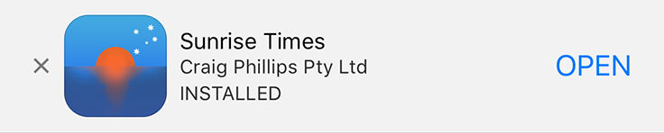
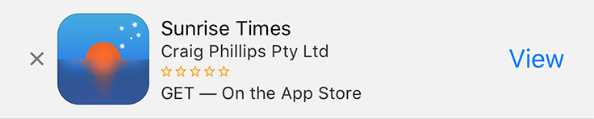
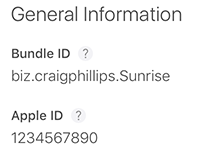

# Smart Banner Plugin

The **Smart Banner** Plugin is made for the [Grav CMS](http://github.com/getgrav/grav). It provides quick and simple way to add [Apple's Smart Banners for iOS apps](https://developer.apple.com/library/archive/documentation/AppleApplications/Reference/SafariWebContent/PromotingAppswithAppBanners/PromotingAppswithAppBanners.html) to your Grav website.

Smart Banners are implemented in Apple's iOS version of Safari to help developers direct users to their apps. Smart Banners have the nice attribute of being aware if the app is already installed and prompting the user to open the app directly.

[](https://sunrisetimes.app)

If the app isn't installed on the users iOS device a version that prompts them to download it from the AppStore is presented.
[](https://sunrisetimes.app)


## Installation

Installing the Smart Banner plugin can be done in one of several ways. The GPM (Grav Package Manager) installation method enables you to quickly and easily install the plugin with a simple terminal command, while the manual method enables you to do so via a zip file.

### GPM Installation

The simplest way to install this plugin is via the [Grav Package Manager (GPM)](http://learn.getgrav.org/advanced/grav-gpm) through your system's terminal (also called the command line).  From the root of your Grav install type:

    bin/gpm install smart-banner

This will install the Smart Banner plugin into your `/user/plugins` directory within Grav. Its files can be found under `/your/site/grav/user/plugins/smart-banner`.

### Manual Installation

To install this plugin, just download the zip version of this repository and unzip it under `/your/site/grav/user/plugins`. Then, rename the folder to `smart-banner`. You can find these files on [GitHub](https://github.com/cppl/grav-plugin-smart-banner) or via [GetGrav.org](http://getgrav.org/downloads/plugins#extras).

You should now have all the plugin files under

    /your/site/grav/user/plugins/smart-banner
	
> NOTE: This plugin is a modular component for Grav which requires [Grav](http://github.com/getgrav/grav) and the [Error](https://github.com/getgrav/grav-plugin-error) and [Problems](https://github.com/getgrav/grav-plugin-problems) to operate.

### Admin Plugin (Simplest Method)

If you use the admin plugin, you can install directly through the admin plugin by browsing the `Plugins` tab and clicking on the `Add` button.

## Configuration

The setup is very simple before starting make sure you have:
 - the ID of your iOS app (found on your app's page on [App Store Connect](https://appstoreconnect.apple.com/))<br>
 - your Affiliate Token (optional)
 - the deeplink to your app you want the AppStore to call after a user installs it 

### Using Admin's Plugin View

 1. Click on "Plugins" in the sidebar
 2. Scroll to "Smart Banner"or if you have a lot of plugins use "Filter" and search for "Smart Banner"
 3. Click on "Smart Banner"
 4. Fill in the fields
 
 Simple, see?

### Manual

Before configuring this plugin manually, you should copy the `user/plugins/smart-banner/smart-banner.yaml` to `user/config/plugins/smart-banner.yaml` and only edit that copy.

Here is the default configuration which includes some sample data that you need to change, below it is an explanation of available options:

```yaml
enabled: true
appID: '0123456789'
affiliateToken: 0000aa
deeplink: 'http://somedomain.com?utm=clickSource'

```
**enabled**: The plugin is enabled. 

**appID**: This is the ID assigned by Apple to your app. You can find it in your apps pages on iTunes Connect. For Smart Banners to work this is the only required field, without it the plugin will not add anything to your website.

**affiliateToken**: This is an entirely optional field. If you are a member of Apple's iTunes Affliate program you can add your Affliate Token here.

**deeplink**: This is an entirely optional field. App Arguments contains a URL that provides context to your app.

Note that if you use the admin plugin, a file with your configuration, and named smart-banner.yaml will be saved in the `user/config/plugins/` folder once the configuration is saved in the admin.

## Usage

Once it's configured with at least the App ID the plugin will run automatically. Remember though you won't be able to test it loading once you've dismissed the Smart Banner on your iOS device. You will have to get another iOS device to test it with — but you can always check the web page for a metatag that looks like this:
```$html
<meta name="apple-itunes-app" content="app-id=0123456789, affiliate-date=0000aa, app-argument=http%3A%2F%2Fsomedomain.com" />
```

## To Do

- [ ] Allow for customisation of the `deeplink` attribute based on the page on the website where it was viewed.

